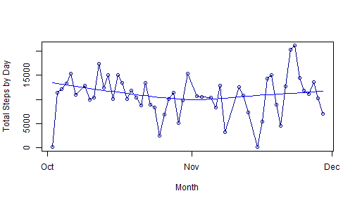
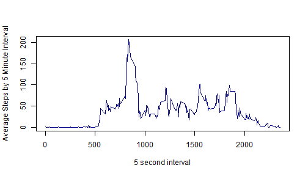
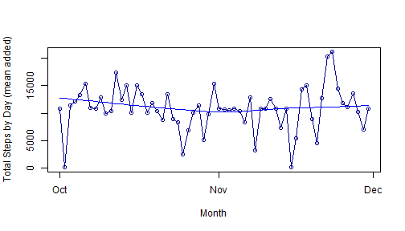
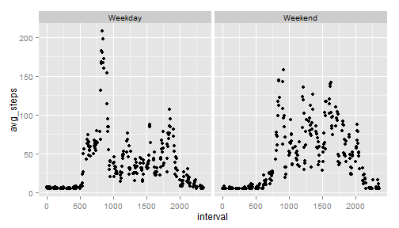

<!---Download the zip file from:
  https://d396qusza40orc.cloudfront.net/repdata%2Fdata%2Factivity.zip
  place csv in your working directory and set the directory below
  --->


```r
#####Read files
library(ggplot2)
setwd("C:/Users/mcryer/Desktop/r/reproduce1")
activity <- read.csv("./activity.csv",head=TRUE,stringsAsFactors=FALSE)

####Captures the rows that have values for steps for mean
whichVector <- as.vector(which(!is.na(activity$steps)))


####Creates new dataframe for filling values
activityNew <- activity


#####assign the mean interval of all non na rows to na rows.
activityNew$steps[is.na(activity$steps)] <- mean(activity[whichVector,1],na.rm=TRUE)
activityNew$steps1<-as.numeric(activityNew$steps)
activityNew$datefix <- strptime( activityNew$date, "%F")


#########AGGREGATIONS
#####Aggregation 1: calculate total steps by day
plotter <- aggregate(x = activity[whichVector,1], by = list(activity[whichVector,2])
                     , FUN = "sum")
#####aggregate loses date format??
plotter$datefix <- strptime( plotter$Group.1, "%F")
colnames(plotter) <- c("date","steps","datefix")

#####Aggregation 2: calculate total steps by interval
plotter2 <- aggregate(x = activity[whichVector,1], by = list(activity[whichVector,3])
                      , FUN = "mean")
colnames(plotter2) <- c("interval","steps")


#####Aggregation 3:Q3 T4 calculate total steps by day with mean added
plotter3 <- aggregate(x = activityNew$steps1, by = list(activityNew$date)
                     , FUN = "sum")
#####aggregate loses date format??
plotter3$datefix <- strptime( plotter3$Group.1, "%F")
colnames(plotter3) <- c("date","steps","datefix")
```

***
 

#### Q1 #1: Steps per day


```r
plotter[,1:2]
```

```
##          date steps
## 1  2012-10-02   126
## 2  2012-10-03 11352
## 3  2012-10-04 12116
## 4  2012-10-05 13294
## 5  2012-10-06 15420
## 6  2012-10-07 11015
## 7  2012-10-09 12811
## 8  2012-10-10  9900
## 9  2012-10-11 10304
## 10 2012-10-12 17382
## 11 2012-10-13 12426
## 12 2012-10-14 15098
## 13 2012-10-15 10139
## 14 2012-10-16 15084
## 15 2012-10-17 13452
## 16 2012-10-18 10056
## 17 2012-10-19 11829
## 18 2012-10-20 10395
## 19 2012-10-21  8821
## 20 2012-10-22 13460
## 21 2012-10-23  8918
## 22 2012-10-24  8355
## 23 2012-10-25  2492
## 24 2012-10-26  6778
## 25 2012-10-27 10119
## 26 2012-10-28 11458
## 27 2012-10-29  5018
## 28 2012-10-30  9819
## 29 2012-10-31 15414
## 30 2012-11-02 10600
## 31 2012-11-03 10571
## 32 2012-11-05 10439
## 33 2012-11-06  8334
## 34 2012-11-07 12883
## 35 2012-11-08  3219
## 36 2012-11-11 12608
## 37 2012-11-12 10765
## 38 2012-11-13  7336
## 39 2012-11-15    41
## 40 2012-11-16  5441
## 41 2012-11-17 14339
## 42 2012-11-18 15110
## 43 2012-11-19  8841
## 44 2012-11-20  4472
## 45 2012-11-21 12787
## 46 2012-11-22 20427
## 47 2012-11-23 21194
## 48 2012-11-24 14478
## 49 2012-11-25 11834
## 50 2012-11-26 11162
## 51 2012-11-27 13646
## 52 2012-11-28 10183
## 53 2012-11-29  7047
```
***

#### Q1 #2: Histogram of steps per day

 

***

#### Q1 #3: Mean and Median of Steps per day


##### The *mean* steps per day:  1.0766189 &times; 10<sup>4</sup>


##### The *median* steps per day: 10765

***
***
***

#### Q2 #1: Time Series Plot


```r
plot(plotter2[,1],plotter2[,2],xlab="5 second interval",ylab="Average Steps by 5 Minute Interval",type="l",col="dark blue")
```

 


#### Q2 #2: Max 5-minute interval

```r
maxAvgStepsInt <- which(plotter2$steps==max(plotter2$steps))
```
The interval with the *max* average steps:  835

***
***
***


#### Q3 #1: Total missing values

```r
cntActivityNAs <- as.numeric()
cntActivityNAs <- length(which(is.na(activity$steps)==TRUE))
```
The *count* of missing 5 step readings:  2304


#### Q3 #2: Strategeeee!


```r
#mean of all intervals na.rm=TRUE
mean(activity[whichVector,1])
```

```
## [1] 37.3826
```


#### Q3 #3: create new data set


```r
#activityNew <- activity
#activityNew$steps[is.na(activity$steps)] <- mean(activity[whichVector,1],na.rm=TRUE)
#activityNew$steps1<-as.numeric(activityNew$steps)
```


#### Q3 #4a: Histogram
 

#### Q3 #4b: Mean and Median of Adjusted Steps per day


The *mean* steps per day:  1.0766 &times; 10<sup>4</sup>

The *median* steps per day: 1.0766189 &times; 10<sup>4</sup>

#### Q3 #4c: Difference Mean and Median steps per day with fix

The difference of means in steps per day: 0

The difference of medians in steps per day: 1.1886792

#### Q3 #4d: Difference Mean and Median steps per day with fix
No impact on means of adding a mean value to every interval lacking a measurment.  Impact of fixing the missing measurements to the median was minimal but measurable.  This makes sense that adding mean measurements would lessen the impact of the measurments of zero when calculating the median.

***
***
***

#### Q4 #1: Factor variable levels

```r
###BOOLEAN TRUE FALSE depending on weekdays call
activityNew$wkDayFlg <- as.factor(weekdays(activityNew$datefix)=="Saturday" | weekdays(activityNew$datefix)=="Sunday" )

###BOOLEAN TRUE FALSE translated to more palatable categorical label
activityNew$wkDayFlg <- sapply(as.character(activityNew$wkDayFlg), switch, 
                  "TRUE" = "Weekend", 
                  "FALSE" = "Weekday")

#####Aggregation 4:Q4 T2 calculate total steps by interval and weekday with mean added
plotter4 <- aggregate(x = activityNew$steps1, by = list(activityNew$interval,activityNew$wkDayFlg), FUN = "mean")

colnames(plotter4) <- c("interval","day_flag","avg_steps")
```

#### Q4 #2: Panel plot


```r
qplot(interval, avg_steps, data = plotter4,facets= .~ day_flag)
```

 


